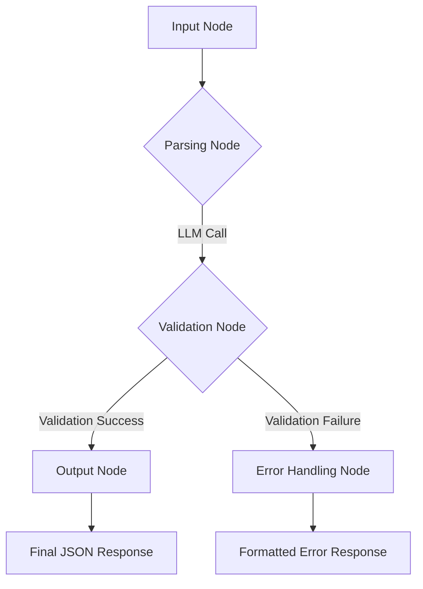

Of course. Here is a comprehensive `README.md` file for the project, based on our detailed plan.

You can copy and paste this directly into a `README.md` file in your project's root directory.

-----

# AI Audience Agent

[](https://www.python.org/downloads/)
[](https://fastapi.tiangolo.com/)
[](https://langchain-ai.github.io/langgraph/)

An AI-powered microservice that translates natural language prompts in English and Arabic into structured JSON filters for audience segmentation.

-----

## ✨ Features

  * **Natural Language Processing:** Understands complex user queries in both English and Arabic.
  * **Structured Output:** Converts prompts into a predictable, machine-readable JSON format.
  * **Robust Validation:** Includes a validation layer to check for supported fields and operators, ensuring output quality.
  * **Full Observability:** Integrated with **LangSmith** for end-to-end tracing and debugging of every request.
  * **Scalable API:** Built with **FastAPI** and ready for containerized deployment.

-----

## 🛠️ Tech Stack

  * **Backend Framework:** FastAPI
  * **AI Orchestration:** LangGraph
  * **Observability:** LangSmith
  * **Data Validation:** Pydantic
  * **Testing:** Pytest
  * **Deployment:** Docker

-----

## 🏛️ Architecture

The application uses a stateful graph built with **LangGraph** to process incoming prompts. This allows for a robust, multi-step flow that includes validation and error handling.

**LangGraph Flow:**



1.  **Input Node:** Receives the raw user prompt.
2.  **Parsing Node:** An LLM call is made with a carefully engineered prompt to extract entities and convert them into a preliminary JSON structure.
3.  **Validation Node:** A Python function checks the generated JSON against a schema of supported `fields`, `operators`, and value types. It also normalizes data (e.g., relative dates).
4.  **Conditional Routing:**
      * If validation passes, the graph transitions to the **Output Node**.
      * If validation fails, the graph transitions to the **Error Handling Node**.
5.  **Output/Error Nodes:** The final, clean JSON or a structured error message is prepared for the API response.

-----

## 🚀 Getting Started

Follow these instructions to set up and run the project on your local machine.

### Prerequisites

  * Python 3.9+
  * A package manager like `pip`
  * An LLM API Key (e.g., from OpenAI, Google, or Anthropic)
  * A LangSmith API Key (optional but highly recommended)

### Installation

1.  **Clone the repository:**

    ```bash
    git clone https://github.com/your-username/ai-audience-agent.git
    cd ai-audience-agent
    ```

2.  **Create and activate a virtual environment:**

    ```bash
    python -m venv venv
    source venv/bin/activate
    # On Windows, use: venv\Scripts\activate
    ```

3.  **Install the required dependencies:**

    ```bash
    pip install -r requirements.txt
    ```

4.  **Set up your environment variables:**
    Create a file named `.env` in the root of the project and add your API keys.

    **.env.example**

    ```env
    # LLM Provider (e.g., OpenAI)
    OPENAI_API_KEY="sk-..."

    # LangSmith Observability
    LANGCHAIN_TRACING_V2="true"
    LANGCHAIN_ENDPOINT="https://api.smith.langchain.com"
    LANGCHAIN_API_KEY="..."
    LANGCHAIN_PROJECT="AI Audience Agent" # Or any name you prefer
    ```

-----

## 🏃 Running the Application

With the setup complete, you can run the FastAPI server.

1.  **Start the server:**
    The `--reload` flag will automatically restart the server when you make code changes.

    ```bash
    uvicorn app.main:app --reload
    ```

2.  **Access the API:**
    The server will be running at `http://127.0.0.1:8000`. You can access the auto-generated documentation at `http://127.0.0.1:8000/docs`.

3.  **Send a test request:**
    Use `curl` or any API client to test the `/parse_prompt` endpoint.

    **English Prompt:**

    ```bash
    curl -X 'POST' \
      'http://127.0.0.1:8000/parse_prompt' \
      -H 'accept: application/json' \
      -H 'Content-Type: application/json' \
      -d '{
      "prompt": "Find customers who joined after Jan 2023 with more than 5 orders"
    }'
    ```

    **Arabic Prompt:**

    ```bash
    curl -X 'POST' \
      'http://127.0.0.1:8000/parse_prompt' \
      -H 'accept: application/json' \
      -H 'Content-Type: application/json' \
      -d '{
      "prompt": "اعثر على العملاء الذين انضموا بعد يناير 2023 ولديهم أكثر من 5 طلبات"
    }'
    ```

-----

## ✅ Testing

The project includes a suite of tests to validate its accuracy against a predefined dataset.

1.  **Run the test suite:**
    From the root directory, run the following command:
    ```bash
    pytest
    ```
2.  **Success Criteria:**
    The tests will pass if the agent achieves **≥ 90% accuracy** in correctly parsing the prompts from the bilingual test dataset located in `tests/data/test_cases.json`.

-----

## 🚢 Deployment

The application is designed to be deployed as a Docker container.

1.  **Build the Docker Image:**

    ```bash
    docker build -t ai-audience-agent .
    ```

2.  **Run the Docker Container Locally:**

    ```bash
    docker run -d --env-file .env -p 8000:8000 ai-audience-agent
    ```

3.  **Deploy to the Cloud:**
    The container image can be pushed to a container registry (like Docker Hub, GCR, or ECR) and deployed to any of the following platforms:

      * **GCP Cloud Run**
      * **AWS ECS (with Fargate)**
      * **Azure App Service**

-----

## 📄 API Documentation

### POST `/parse_prompt`

This endpoint accepts a natural language prompt and returns a structured JSON filter.

**Request Body:**

```json
{
  "prompt": "string"
}
```

**Success Response (200 OK):**

```json
{
  "filters": [
    {
      "field": "joining_date",
      "operator": ">",
      "value": "2023-01-01"
    },
    {
      "field": "total_orders",
      "operator": ">",
      "value": 5
    }
  ]
}
```

**Error Response (400 Bad Request):**
This occurs if an unsupported field is mentioned in the prompt.

```json
{
  "detail": "The field 'email_open_rate' is not supported. Please use one of: ['gender', 'birthday', 'joining_date', ...]"
}
```