I can certainly help with that. Here is a perfectly formatted README for the AI Audience Agent project.

-----

# AI Audience Agent

An AI-powered microservice that translates natural language prompts in English and Arabic into structured JSON filters for audience segmentation. This project is fully containerized with Docker and features a complete CI/CD pipeline using GitHub Actions for automated deployment to AWS.

### **✨ Features**

  - **Natural Language Processing**: Understands complex user queries in both English and Arabic.
  - **Structured Output**: Converts prompts into a predictable, machine-readable JSON format.
  - **Robust Validation**: Includes a validation layer to check for supported fields, operators, and normalize complex values (e.g., relative dates).
  - **Full Observability**: Integrated with **LangSmith** for end-to-end tracing and debugging of every request.
  - **Secure & Scalable Deployment**: Deployed as a public service on **AWS App Runner**, protected at the edge by **AWS Web Application Firewall (WAF)**.
  - **Automated CI/CD**: A complete GitHub Actions pipeline automatically tests, builds, and deploys the application on every push to the `main` branch.

<br>

-----

### **🏛️ Final Architecture**

The final architecture uses AWS WAF as a security layer in front of a public AWS App Runner service. WAF inspects all incoming traffic and blocks unauthorized requests before they can reach the application.

```mermaid
graph TD
    subgraph "Public Internet"
        A[Client]
    end

    subgraph "AWS Cloud"
        A -- HTTPS Request w/ API Key --> B[AWS WAF];
        B -- Blocks or Allows --> C[AWS App Runner Service];
        C -- Runs Docker Container --> D[FastAPI App];
        D -- Invokes --> E[LangGraph Agent];
    end

    E -- Parses & Validates --> F[✅ Valid JSON / ❌ Error];
```



<br>

-----

### **🚢 CI/CD Pipeline**

This project is configured with a complete Continuous Integration and Continuous Deployment (CI/CD) pipeline using GitHub Actions.

  - **Trigger**: The workflow automatically runs on every `git push` to the `main` branch.
  - **Jobs**:
    1.  **Build**: Builds a new Docker image from the application's source code.
    2.  **Push**: Tags the image with the unique Git commit SHA and pushes it to a private Amazon ECR repository.
    3.  **Deploy**: Securely updates the AWS App Runner service to pull and deploy the new image from ECR, ensuring a zero-downtime update.

<br>

-----

### **🛡️ Security**

The application endpoint is protected at the edge by **AWS Web Application Firewall (WAF)**.

  - **Authentication**: The WAF is configured with a rule that requires a secret API Key to be sent in the `x-api-key` header of every request.
  - **IP Restriction**: A second rule is in place to only allow requests from a specific IP address, providing an additional layer of security.
  - **Default Action**: The WAF's default action is to **Block** all requests that do not match the allow rules, ensuring no unauthorized traffic reaches the application.

<br>

-----

### **✅ Testing & Validation**

The project includes a comprehensive, data-driven test suite to ensure high accuracy.

  - **Test Dataset**: A formal dataset of over 50 test cases is located at `tests/test_data.json`. It covers all supported fields, operators, and edge cases in both English and Arabic.
  - **Local Testing**: You can run the full suite against a local server using `pytest`.
    ```sh
    pytest -v
    ```
  - **Accuracy Measurement**: An evaluation script, `run_accuracy_test.py`, can be run against the deployed endpoint to calculate and report the final accuracy score, ensuring it meets the **\>90%** success criteria.

<br>

-----

### **🚀 Running the Application**

#### **Local Development**

1.  Clone the repository and install dependencies from `requirements.txt`.
2.  Set up your `.env` file with your `GOOGLE_API_KEY` and LangSmith credentials.
3.  Run the server:
    ```sh
    uvicorn app.main:app --reload
    ```

#### **Interacting with the Deployed API**

To interact with the final, deployed API, you must provide your App Runner public URL and the secret API Key.

**Example `curl` Request:**

```sh
curl -X 'POST' \
  'https://w2xhkmywby.us-east-2.awsapprunner.com/parse_prompt' \
  -H 'Content-Type: application/json' \
  -H 'x-api-key: YOUR_SECRET_API_KEY' \
  -d '{
  "prompt": "Find customers with more than 10 orders"
}'
```

**Success Response (`200 OK`):**

```json
{
  "filters": [
    {
      "field": "total_orders",
      "operator": ">",
      "value": 10
    }
  ]
}
```
